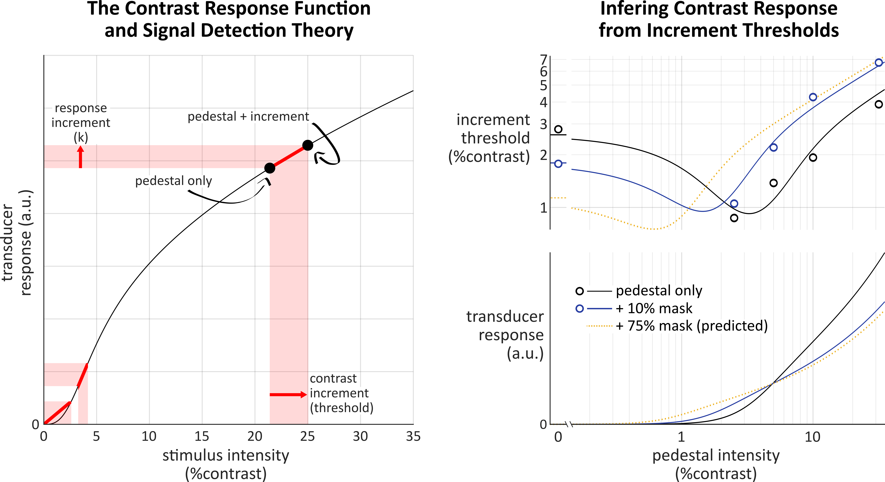

[![CC BY 4.0][cc-by-shield]][cc-by]

# psychoCRFdemo
Small demo for generating a psychophysical contrast response (transducer) function and translate it into a threshold vs contrast psychophysical funciton using signal detection theory.

Model, threshold data and fits taken from [Meese, T. S., et al. (2007). "Contextual modulation involves suppression and facilitation from the center and the surround." Journal of Vision 7(4): 21.]. Using modulated self-suppression model 3 and data from observer RHS.

<!---->
<!---->
<!---->
